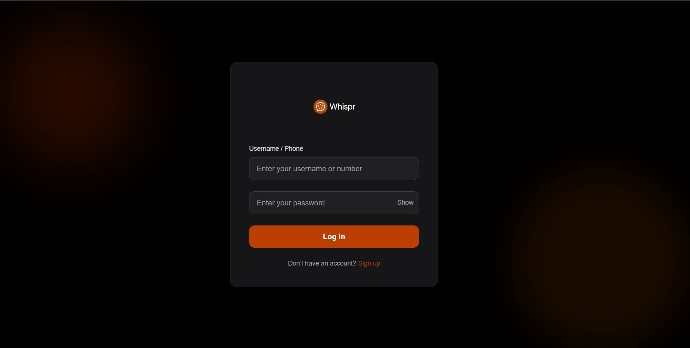
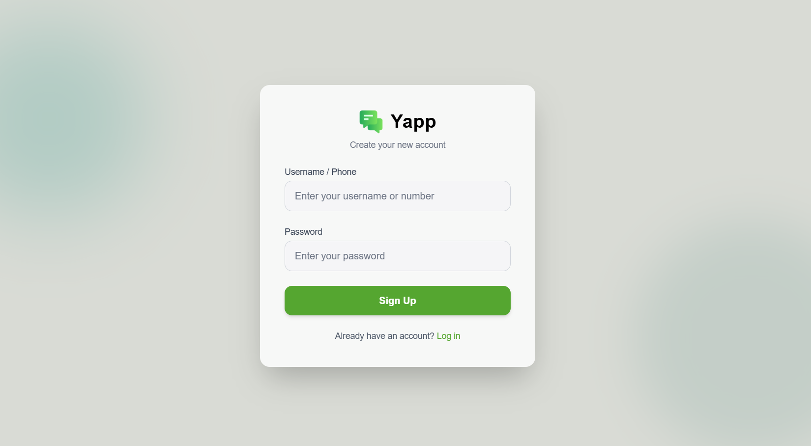

# 🗨️ Yapp — Realtime Chat App

**Yapp** is a realtime 1-to-1 chat application built with a microservices architecture.  
It features seamless authentication, modern UI, media sharing, and instant messaging using WebSockets.  
Designed for scalability, speed, and a clean experience.

---

🎯 **Live Demo** → [whispr-chat-app-frontend.onrender.com](https://whispr-chat-app-frontend.onrender.com)  
🚀 Ready to chat instantly — No install required!

---
Screenshots:

### 🔐 Login Page

### 💬  Chat UI

---
## ✨ What's New

- 🖼️ **Media Sharing Support** — Send images and GIFs directly in chat!
- 🎨 **UI Improvements** — Smoother login and chat design for better UX
- ☁️ **Deployed Online** — Users can now experience Whisper live

---

## 🚀 Features

> Whisper is built to deliver fast, private 1-to-1 messaging in real-time.

- 🔐 **JWT-based Signup/Login** (via Auth Service)
- 💬 **Realtime Chat** using WebSockets
- 🖼️ **Media Sharing** — Images, GIFs ✅ *(New)*
- 🛎️ **Live Toast Notifications** for new messages
- 🧭 **Microservices Architecture**
- 💅 **Modern UI** with Tailwind CSS ✅ *(Improved)*
- 🐳 **Dockerized Setup** with easy build scripts

---

## 📦 Tech Stack

| Layer         | Tech                |
|--------------|---------------------|
| Frontend     | Next.js, Tailwind CSS |
| Backend      | Node.js, Express     |
| Realtime     | WebSockets           |
| Auth         | JWT                  |
| Database     | MongoDB              |
| Containerize | Docker               |

---

## 🛠️ Getting Started (Local Setup)

# Clone the repository
git clone https://github.com/lovepreetcodes/Yapp-chat-app.git
cd whisper-chat-app

# Create .env files in each service:
- auth-backend/.env
- backend/.env
- frontend/client/.env (if required)

# Build Docker images
docker build -t whisper-auth ./auth-backend
docker build -t whisper-backend ./backend
docker build -t whisper-client ./client

# Or use docker-compose
docker-compose up --build

🤝 Contributing
I welcome contributions and suggestions. If you find issues or want to help, feel free to open a pull request or issue.

