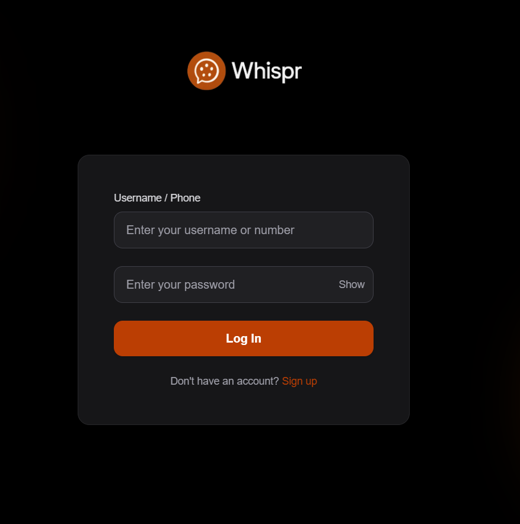
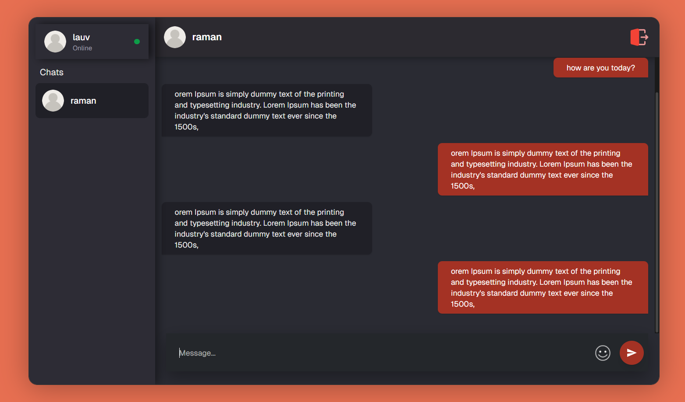

# 🗨️ Whisper — Realtime Chat App

**Whisper** is a realtime 1-to-1 chat application built with a microservices architecture. It features seamless authentication, clean UI, and instant messaging using WebSockets. Designed for scalability and clarity, it separates concerns across dedicated services for authentication and messaging.

---

## 🚀 Features

- 🔐 JWT-based Signup/Login (via Auth Service)
- 💬 Realtime 1-to-1 Messaging using WebSockets
- 🛎️ Live Message Notifications
- 🧭 Microservices Architecture
- 💅 Clean, Modern UI (Next.js + Tailwind)
- 🐳 Dockerfile provided for containerization

---

## 🛠️ Getting Started (Local Setup)

1. **Clone the repository**
# Inside each service folder, create a .env file:
- auth-backend/.env
- backend/.env
- client/.env  (if required)
  
# Build individual images
docker build -t Whisper-Chat-App./auth-backend
docker build -t Whisper-Chat-msg ./backend
docker build -t whisper-client ./client

# Or, if using docker-compose
docker-compose up --build
# Or, if using docker-compose
docker-compose up --build

🏗️ Tech Stack
Frontend: Next.js, Tailwind CSS

Backend: Node.js, Express

Realtime: WebSockets

Database: MongoDB

Authentication: JWT

Containerization: Docker

📁 Project Structure
bash
Copy
Edit
.
├── auth-backend/          # Handles authentication and user logic
├── backend/               # Handles chat and WebSocket logic
├── frontend/client        # Next.js frontend
├── Screenshots            # images
└── README.md
---

## 📷 Screenshots

### 🔐 Login Page

### 🗨️ Realtime Chat UI

📌 
Planned future enhancements:

👥 Group Chats

🖼️ Media Attachments

🌐 Online/Offline Indicators

🔍 Chat Search

🔄 Refresh Token Flow

📱 PWA Support

🤝 Contributing
We welcome contributions and suggestions. If you find issues or want to help, feel free to open a pull request or issue.

